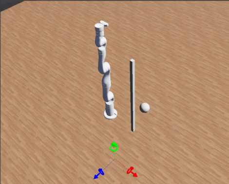

# Reinforcement Learning using Webots simulation

This repository uses Open AI Gym along with Webots phyisics simulation to control a 7 DOF Kinova manipulator robot path movement towards a desired goal with obstacle avoidance, using reinforcement learning.

### To-Do
- Currently avoidance is only applied to the manipulator end effector, subsequent joints do not avoid accordingly. 



## Prerequisites


### Install Webots!

- Install Webots [HERE](https://cyberbotics.com/#download)


### Install Required Python Packages!

pip install -r requirements.txt


## File Structure
```
├── src                     # Source files (alternatively `lib` or `app`)
│   ├── controllers          # Webots controller directories
│   │	├── kinova  		 # Controller for 7 DoF Kinova Robot
│   │	└── supervisor   	 # Supervisor controller (RL Agent)
│   └── worlds				 # Webots worlds
├── requirements.txt
└── README.md
```
## Usage
- From within Webots, navigate to the File tab, and select open world 

- Browse to the worlds directory and open the kinova_gen3_mode_Test.wbt

- Run simply by pressing the play button at the top of the webots UI. 

- The robot model is saved as Robot.wbo, located under src\controllers\supervisorController.

- The robot is controlled using the webots robot controller architecture. The python script doing so is located at src\controllers\Kinova\Kinova.py

- PyTorch implementation of the NAF algorithm and related utilities are located under the supervisor controller directory. 

### Tutorials and Info

- Open AI Baselines:
  - https://github.com/openai/baselines

- Deepbots Webots Integration:
  - https://github.com/aidudezzz/deepbots

- Introduction to Webots:
  - https://cyberbotics.com/doc/guide/getting-started-with-webots

